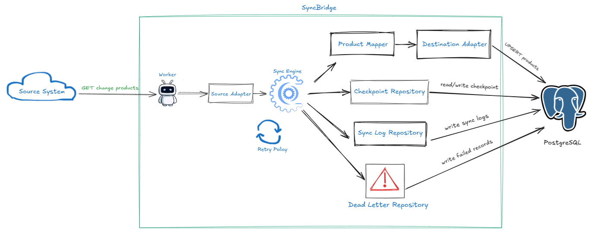

# SyncBridge

SyncBridge is a **C#/.NET 8 worker service** for incrementally synchronizing data between two systems.  
This project demonstrates practical backend integration concepts such as **checkpointing, idempotent upserts, retry handling, dead-letter logging, and Docker-based local deployment**.

## Overview

In many real-world systems, data often lives in separate platforms and must be kept consistent across environments. A common example is syncing product data from an external API into an internal database.

SyncBridge solves this problem by:

- reading changed records from a **source system**
- transforming them into a **target model**
- writing them into a **destination system**
- storing progress using **checkpoints**
- retrying transient failures
- isolating invalid records into a **dead-letter store**

## Project Scenario

This implementation uses the following demo scenario:

- **System A (Source):** Mock REST API
- **System B (Destination):** PostgreSQL
- **Domain:** Product data
- **Direction:** One-way sync from source to destination
- **Sync strategy:** Incremental sync based on `updatedAt` + cursor continuation with `afterId`

## Key Features

- Incremental synchronization using `updatedAt`
- One-way data sync from source API to PostgreSQL
- Upsert processing to avoid duplicate records
- Checkpoint persistence for restart-safe progress recovery
- Retry handling for transient API and database failures
- Dead-letter handling for failed records
- Adapter-based architecture for source and destination systems
- Docker Compose support for local end-to-end demo

## Architecture

<p align="center">
  <a href="./docs/architecture.md">
    
  </a>
</p>

```text
SourceMockApi --> SyncBridge.Worker --> PostgreSQL
                       |                  |
                       |                  +--> products
                       +--> sync_checkpoint
                       +--> sync_log
                       +--> sync_dead_letter
```

## Project Goals

This project was built to practice and demonstrate:

- backend system integration
- incremental data loading
- idempotent synchronization
- retry and resilience patterns
- clean architecture in C#
- reliable data transfer between systems

## Tech Stack

- **.NET 8**
- **C#**
- **Worker Service**
- **Minimal API**
- **HttpClient**
- **Dapper**
- **PostgreSQL**
- **Docker / Docker Compose**

## Repository Structure

```text
.
├── README.md
├── docker-compose.yml
├── database/
│   └── init.sql
└── src/
    ├── SyncBridge.Worker.slnx
    ├── SyncBridge.SourceMockApi/
    │   ├── Dockerfile
    │   ├── Program.cs
    │   ├── SyncBridge.SourceMockApi.csproj
    │   ├── Data/
    │   ├── Models/
    │   └── Properties/
    └── SyncBridge.Worker/
        ├── appsettings.json
        ├── Dockerfile
        ├── Program.cs
        ├── SyncBridge.Worker.csproj
        ├── Core/
        ├── Destination/
        ├── Infrastructure/
        ├── Mapping/
        ├── Options/
        ├── Source/
        ├── Workers/
        └── Properties/
```

## Data Flow

Each sync cycle follows this process:

1. Load the last successful checkpoint
2. Request changed products from the source API
3. Transform source DTOs into destination entities
4. Upsert records into PostgreSQL
5. Record failed rows in dead-letter storage if needed
6. Write execution logs
7. Update checkpoint after a successful sync run

## Core Concepts

### Incremental Sync
SyncBridge does not reload all records every time.  
It only requests records that were updated after the last saved checkpoint.

### Upsert
If a record already exists in the destination database, it is updated.  
If it does not exist, it is inserted.

### Checkpointing
A checkpoint stores the most recent successful synchronization point.  
This allows the worker to resume safely after restarts or failures.

### Retry Handling
Transient failures such as API timeouts or temporary database connection issues are retried automatically.

### Dead-Letter Handling
Invalid or failed records are isolated into a dead-letter store so one bad record does not stop the whole sync job.

## Example Source Payload

```json
{
  "items": [
    {
      "id": 101,
      "name": "Mechanical Keyboard",
      "sku": "KB-101",
      "price": 1200000,
      "currency": "VND",
      "updatedAt": "2026-04-23T10:00:00Z"
    }
  ],
  "hasMore": false,
  "nextCursor": {
    "updatedAt": "2026-04-23T10:00:00Z",
    "id": 101
  }
}
```

## Configuration

### Worker `appsettings.json`

```json
{
  "ConnectionStrings": {
    "TargetDb": "Host=localhost;Port=5432;Database=syncbridge;Username=postgres;Password=your_password"
  },
  "SourceApi": {
    "BaseUrl": "http://localhost:5001",
    "PageSize": 5,
    "TimeoutSeconds": 30
  },
  "Sync": {
    "JobName": "product-sync",
    "IntervalSeconds": 20,
    "MaxRetries": 3,
    "RetryDelayMilliseconds": 1000
  }
}
```

## Getting Started

### Prerequisites

Make sure you have the following installed:

- .NET 8 SDK
- Docker
- Docker Compose

### Clone the Repository

```bash
git clone https://github.com/RudeusGs/SyncBridge.git
cd SyncBridge
```

## Run with Docker Compose

First, set up your `.env` file (recommended for Docker Compose):

```bash
cp .env.example .env
```

Start the full system:

```bash
docker compose down -v
docker compose up --build
```

This will start:

- PostgreSQL
- SourceMockApi
- SyncBridge.Worker
- SyncBridge.AdminApi

### Docker Ports

- SourceMockApi: `http://localhost:5001`
- AdminApi: `http://localhost:5002`
- PostgreSQL: `localhost:5432`

## Run Locally

### 1. Start PostgreSQL

```bash
docker compose up postgres -d
```

### 2. Run SourceMockApi

```bash
dotnet run --project src/SyncBridge.SourceMockApi
```

Source API will run on:

```text
http://localhost:5001
```

Test endpoints:

```text
http://localhost:5001/
http://localhost:5001/health
http://localhost:5001/api/products
```

### 3. Run Worker

```bash
dotnet run --project src/SyncBridge.Worker
```

The worker will:

- read the checkpoint
- fetch source data page by page
- upsert records into PostgreSQL
- write sync logs
- update checkpoint

## Example Sync Workflow

Example sync run:

- load checkpoint
- request source data using `updatedAfter` and `afterId`
- receive changed products in pages
- upsert into PostgreSQL
- update checkpoint to the newest cursor

## Database Tables

The project uses these tables:

- `products`
- `sync_checkpoint`
- `sync_log`
- `sync_dead_letter`

## Useful SQL Checks

```sql
SELECT * FROM products ORDER BY id;
SELECT * FROM sync_checkpoint;
SELECT * FROM sync_log ORDER BY id DESC;
SELECT * FROM sync_dead_letter ORDER BY id DESC;
```

## Dead-letter Replay

A dead-letter record is a data entry that failed to synchronize due to validation issues, deserialization errors, or other unrecoverable problems. When a product is stored in `sync_dead_letter`, the worker skips it so the rest of the sync job can continue.

Dead-letter statuses:
- **Pending**: Record failed and is waiting to be reviewed or replayed.
- **Retrying**: A replay has been triggered and is currently processing.
- **Resolved**: Replay was successful. The record is fixed.
- **Failed**: Replay failed. The record requires further inspection. The `replay_error_message` column contains details.
- **Ignored**: Record was intentionally ignored and will not be replayed.

How replay works:
Replay can be triggered via the Admin API. Successful replay marks the record as `Resolved`. Failed replay marks the record as `Failed` and stores the reason in `replay_error_message`. The `retry_count` increases and `last_retried_at` updates on every replay attempt.

### Admin API Endpoints

View dead-letter records:
```bash
curl http://localhost:5002/api/dead-letters
```

Filter by status:
```bash
curl "http://localhost:5002/api/dead-letters?status=Failed"
```

Replay one record:
```bash
curl -X POST http://localhost:5002/api/dead-letters/1/replay
```

Replay pending/failed records for a job:
```bash
curl -X POST http://localhost:5002/api/dead-letters/replay \
  -H "Content-Type: application/json" \
  -d '{"jobName":"product-sync","limit":20}'
```

## Current Scope

The current project scope includes:

- one-way synchronization
- product data sync
- incremental loading
- checkpoint persistence
- upsert logic
- retry handling
- logging
- dead-letter handling
- dead-letter replay and Admin API

## Suggested GitHub Topics

```text
csharp dotnet worker-service data-sync synchronization postgresql dapper docker backend
```
